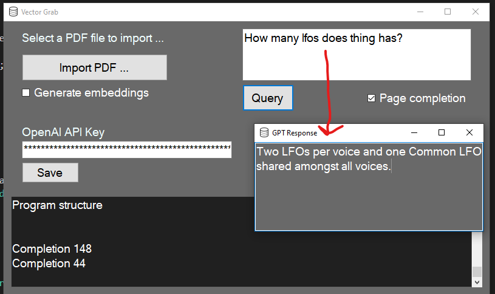

# Vector Grab AI - 1.1 beta

**What is it?**

It is a utility written in *C# dotnet* to allow you to query against your own PDF files using **OpenAI models**.

**How I use it?**

1. You just put in your **OpenAI API key** which will be placed in the local system registry when you click save.

2. If you have a new PDF file you want to create embeddings for, check create embeddings before opening the PDF file.

3. After embeddings have been created, you can enter your query and get results back.

------------------

# FAQ

**Why did you create this?**

I wanted an easy windows way of querying against a very large **Korg Kross 2** manual for a synthesizer, the synethesizer has many parameters and this tool makes it easy to find out about functions etc.

**Can I work with multiple PDFs at the same time?**

In the current version you cannot work with multiple PDF files at the same time, but this can be added in the future if that is something required.

**What are some possible uses?**

You may have very large reference manuals, that are used for research or learning to use something.  With this tool you can queries these very large PDF files simply and easily without too much trouble.

